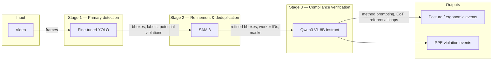
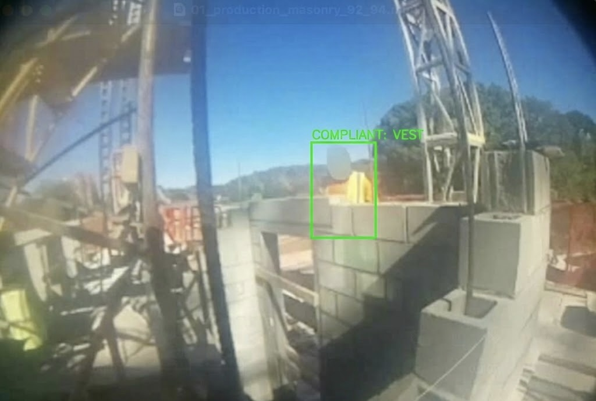
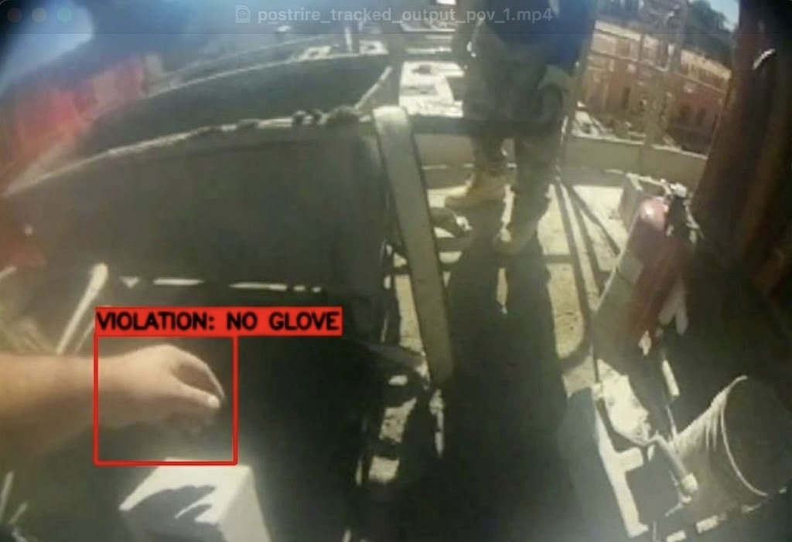
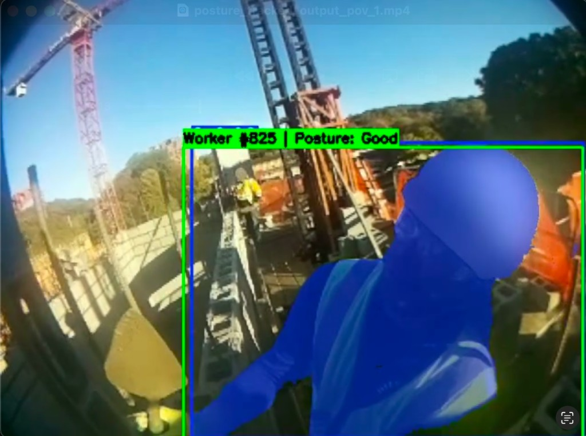
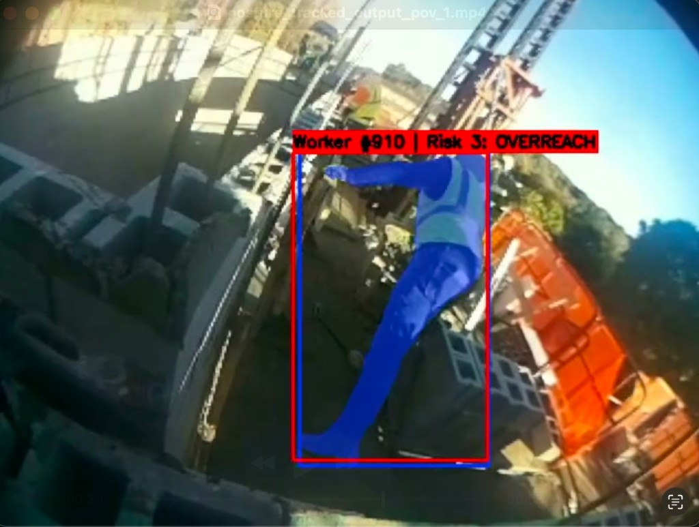

# Construction Site Safety Intelligence Dashboard - UMD IRONSITE HACKATHON '26

An ML-powered end-of-day safety reporting dashboard for construction sites. Pulls from two independent camera data sources — POV body-worn footage and fixed wall-mounted cameras — to tag PPE violations, track OSHA violations, and surface per-worker safety reports.

---

## Problem Statement

- In 2023, U.S. construction workers experienced approximately **1,075 fatal injuries** on the job.
- The BLS measured a fatal work injury rate of **9.6 deaths per 100,000** full-time equivalent workers.
- Construction had the **most fatalities of any industry sector** in 2023.
- The majority of those who died were men (91.5%); women accounted for 8.5%.
- Most incidents are **preventable** — fall protection alone accounts for the single largest violation category cited by OSHA year over year.

The core gap: no affordable, passive, continuous monitoring system exists that can watch multiple workers across a site, resolve their identities over time, and produce an actionable report without requiring real-time human review.

---

## Approach

Our approach processes video at the end of a shift rather than in real-time, making it practical to deploy on commodity hardware. Users can choose to feed the system either **POV body-worn cameras** (posture and PPE on first-person footage) or **fixed wall-mounted cameras** (site-wide ergonomic and PPE analysis). Both posture and PPE analysis use the **same three-stage pipeline**: **Stage 1 — Primary detection** (fine-tuned YOLO) → **Stage 2 — Refinement & deduplication** (SAM 3) → **Stage 3 — Compliance verification & hallucination control** (fine-tuned Qwen3 VL 8B Instruct). YOLO produces initial bounding boxes and labels; SAM 3 refines masks, tags workers, and deduplicates; the VLM validates outputs with method prompting, chain-of-thought, and referential loops to enforce OSHA and reduce hallucination. See [Architecture (three-stage pipeline)](#architecture-three-stage-pipeline) below for the detailed flow.


### Worker Tagging & Object Permanence

Maintaining a consistent worker identity across an entire shift is a core technical problem — especially in the wall-cam system where workers move in and out of frame, get occluded, and reappear later. We address this with:

- **Lightweight identity DB** — stores per-worker appearance embeddings with a unique persistent ID per worker per site
- **Object permanence module** — when a worker disappears from frame, the system holds their last known state and re-associates them on reappearance using embedding similarity rather than requiring continuous tracking
- **Worker tagging** — each worker is assigned an ID at shift start; the DB persists across days so violation history accumulates over time

---

### Dashboard Aggregation

At end of shift, both pipelines write to a shared event store keyed by worker ID. The dashboard reads from this to generate reports — it does not need to know which camera source each event came from.

---

## Architecture (three-stage pipeline)

Both **posture/ergonomics** and **PPE violation detection** share the same three-stage architecture. Artifacts flow from left to right; the VLM consumes refined outputs from Stages 1–2 plus video or key frames to produce compliance-checked final flags.



| Stage | Component | Role | Output |
|-------|-----------|------|--------|
| **1** | Fine-tuned YOLO | First pass on video: workers, PPE items, poor-posture candidates, violation candidates | Initial bounding boxes, class labels, frame-level detections |
| **2** | SAM 3 (Segment Anything Model 3) | Worker tagging, deduplication, refined masks and bboxes (MoE segmentation) | Refined bboxes, worker/track IDs, segmentation masks |
| **3** | Fine-tuned Qwen3 VL 8B Instruct | Validates Stage 1–2 outputs; method prompting, chain-of-thought, referential loops; enforces OSHA; reduces hallucination | Compliance-checked violation flags → **final posture & ergonomic outputs** and **final PPE violation outputs** |

**Backend implementation:** Stage 1–2 for wall-cam are in `backend/pipeline/wall_cam.py` (YOLO + BoT-SORT tracker → SAM3 masks → PPE association and hazard events → annotated frames and person crops for the VLM). The posture stream uses `backend/pipeline/posture.py` (YOLO pose model → joint angles → REBA-inspired risk and violation types → posture events; optional VLM pass). Stage 3 is in `backend/pipeline/vlm_step.py`: three-pass adversarial chain-of-thought (Jamie generator, Marcus discriminator, Marcus reconciler) with confidence calibration using YOLO/SAM data. The VLM consumes hazard frames, annotated images, and optional video chunks to produce structured assessments (`VLMAssessment` with hazards, PPE status, and recommendations).

**Notebooks and CLI:** End-to-end posture (YOLO + SAM 3 + pose → angles → risk → per-worker log) is in `Posture_sam3_style.ipynb`; PPE (YOLO + SAM 3, CLASS_MAP, worker safety log) in `Sam3_test.ipynb`. For POV-only timestamp analysis without the full backend: `analyze_pov_posture_timestamps.py` (pose + ergonomic risk, compliant/noncompliant ranges, export clips/JSON/CSV) and `analyze_pov_ppe_timestamps.py` (PPE association, compliant/noncompliant ranges, export clips).

---

## OSHA Violation Coverage

The system flags detectable violations drawn from OSHA's top cited standards. Coverage depends on what each camera modality can observe:

| OSHA Standard | Violation | Detectable Via |
|---|---|---|
| 1926.501 | Fall protection — unguarded edges, open holes | Wall cam (zone + proximity) |
| 1926.503 | Fall protection training compliance | Worker history DB |
| 1926.451 | Scaffolding — improper use, missing guardrails | Wall cam (spatial) |
| 1926.102 | Eye/face protection (PPE absent) | Wall cam |
| 1910.212 | Machine guarding — worker too close to unguarded machinery | Wall cam (proximity) |
| Ergonomic / MSD risk | Improper lifting, sustained awkward posture | POV |
| Ladder safety | Improper ladder use, overreach | Wall cam |
| Respiratory protection | Missing respirator in flagged zones | Wall cam (PPE detection) |

Violations are scored by severity and frequency. Workers with repeated violations are surfaced prominently in the report.

---

## Dashboard Output

At the end of a shift, the dashboard generates a per-worker report:

- **Worker card** — persistent ID, camera coverage hours, thumbnail
- **Violation log** — timestamped list of flagged events with clip preview
- **Compliant behavior log** — instances of correct PPE use, safe zone adherence, proper posture
- **Ergonomic risk score** — aggregate MSD risk based on posture analysis from POV footage
- **Site heatmap** — spatial occupancy map showing where each worker spent time relative to hazard zones

---

## Results

Example outputs from the pipeline on construction-site footage: PPE compliance (compliant vs violation) and posture/ergonomic risk (good posture vs at-risk).

### PPE: compliant vs violation

| No violation (compliant) | Violation (missing PPE) |
|--------------------------|--------------------------|
| [](assets/results/ppe_compliant.png) | [](assets/results/ppe_violation.png) |
| **Compliant: vest** — Worker building a concrete block wall; system correctly identifies the high-visibility safety vest and labels the worker as compliant. (Wall-cam / site view.) | **Violation: no glove** — POV frame; system flags an exposed hand with a red bounding box and label "VIOLATION: NO GLOVE" for missing hand protection. |

### Posture: no risk vs risk

| No risk (good posture) | Risk (ergonomic hazard) |
|------------------------|--------------------------|
| [](assets/results/posture_good.png) | [](assets/results/posture_risk_overreach.png) |
| **Worker #825 — Posture: Good** — Worker segmented (blue mask), green bounding box; pose and PPE (hard hat, vest) assessed as compliant. (POV.) | **Worker #910 — Risk 3: OVERREACH** — Worker segmented; red box and label indicate elevated arm/reach classified as OVERREACH with risk level 3 for musculoskeletal strain. (POV.) |

---

## Data & Datasets

We used a substantial amount of video and derived data to develop and validate the posture and PPE pipelines.

**Research & reference datasets**
- **CWPV Dataset** — Working Postures of Construction Workers Videos. POV footage of construction workers performing real tasks, annotated for musculoskeletal posture analysis. [Figshare](https://figshare.com/articles/dataset/CWPV_A_Working_Postures_of_the_Construction_Working_Postures_Videos_dataset/27907818)
- **Video dataset for safe/unsafe behaviours (Önal & Dandıl)** — High-resolution video dataset (691 clips, 8 behaviour classes) from fixed IP cameras in a production facility; used as reference for wall-cam behavioural classification. [PMC](https://pmc.ncbi.nlm.nih.gov/articles/PMC11367630/) · [Mendeley Data](https://data.mendeley.com/datasets/xjmtb22pff/1)
- **OSHA Top Violations 2024** — [osha.gov](https://www.osha.gov/top10citedstandards/)

**PPE & construction safety image/video datasets (training & reference)**
- **Ultralytics Construction-PPE** — 11 classes (helmet, vest, gloves, boots, goggles, person + no_helmet, no_goggles, no_gloves, no_boots). Used for PPE detector training and pipeline design. [Docs](https://docs.ultralytics.com/datasets/detect/construction-ppe/#dataset-structure)
- **Construction site safety (Roboflow)** — [Kaggle](https://www.kaggle.com/datasets/snehilsanyal/construction-site-safety-image-dataset-roboflow/data)
- **PPE kit detection — construction site workers** — [Kaggle](https://www.kaggle.com/datasets/ketakichalke/ppe-kit-detection-construction-site-workers)
- **PPE dataset (YOLOv8)** — [Kaggle](https://www.kaggle.com/datasets/shlokraval/ppe-dataset-yolov8)
- **PPE detection v1** — [Kaggle](https://www.kaggle.com/datasets/beyzakucuk/ppe-detection-v1)
- **SH17 dataset for PPE detection** — [Kaggle](https://www.kaggle.com/datasets/mugheesahmad/sh17-dataset-for-ppe-detection/data)

**POV video used in this project**
- **Ironsite Hackathon / production dataset** — Long-form POV videos (e.g. 15–20+ minutes per clip) from construction and production scenarios (masonry, prep, standby, transit). Used for posture analysis, PPE analysis, and pipeline testing.
- **Annotated runs** — Posture- and PPE-tracked outputs (per-worker labels, compliant/non-compliant segments) generated from the above for validation and tuning.

**Derived datasets for validation**
- **Testing_Data_Posture** — Per-video folders of compliant and non-compliant clips (1–2+ minutes each) exported from the posture pipeline for human review and threshold tuning.
- **Testing_Data_PPE** — Same structure for PPE (compliant vs missing hard hat/vest/gloves).
- **Sample frames** — Frame-level exports (e.g. every 8 frames) from selected videos for frame-by-frame review and agreement/disagreement analysis.

**Other video**
- Short clips (youtube) used for demos and additional posture/PPE testing.

Overall, the pipeline has been run on many hours of POV footage across multiple videos; the testing datasets and sample frames support iterative refinement of posture and PPE logic.

---

## Product / research findings

**Implemented:** Backend three-stage pipeline: YOLO + SAM3 + VLM in `wall_cam.py` (PPE and proximity hazards), YOLO pose + ergonomic heuristics in `posture.py` (angles, REBA-style risk, violation types: `MSD_HIGH_RISK`, `AWKWARD_POSTURE`, `OVERREACH`, `KNEELING_SQUATTING_LOW`), and `vlm_step.py` (Qwen3-VL-8B three-pass adv-CoT, structured `VLMAssessment`). Ergonomic MVP in `ergonomic/mvp.py` (angles from keypoints, risk from angles, optional POST to `/events/ingest`). Posture and PPE notebooks (`Posture_sam3_style.ipynb`, `Sam3_test.ipynb`) and CLI timestamp scripts (`analyze_pov_posture_timestamps.py`, `analyze_pov_ppe_timestamps.py`) for POV compliant/noncompliant ranges and clip export. Dashboard and SQLite DB with workers, shifts, and safety events.

**Validated / tuned:** Long POV footage runs; testing datasets (`Testing_Data_Posture`, `Testing_Data_PPE`) and sample frames for threshold tuning; VLM three-pass design for hallucination control and OSHA alignment; PPE temporal smoothing and confidence thresholds in the PPE script; posture confidence gates and REBA thresholds in the posture pipeline.

**Models and weights:** Fine-tuned YOLO PPE detector (`backend/models/last.pt`), SAM3 (`/workspace/models/sam3.pt`), Qwen3-VL-8B-Instruct base (`/workspace/models/qwen3-vl`), optional LoRA adapter (`/workspace/models/adapter1`), YOLO pose (`/workspace/models/yolo26l-pose.pt` or `POSE_MODEL_PATH`).

**Limitations and open problems:** Re-ID and object permanence for wall-cam are as designed but not fully deployed; PPE false positives under variable lighting; threshold sensitivity for “good” vs borderline posture; POV obstruction limits signal when the camera view is blocked. See [Open Problems](#open-problems) below.

---

## Running the Application

**Prerequisites:** Python 3.10+, [Bun](https://bun.sh), a GPU instance with CUDA (tested on 4× RTX PRO 6000 Blackwell)

**Model weights required** (not committed — place before running):
- `backend/models/last.pt` — fine-tuned YOLO11 PPE detector
- `/workspace/models/sam3.pt` — SAM3 segmentation model
- `/workspace/models/qwen3-vl` — Qwen3-VL-8B-Instruct base model
- `/workspace/models/adapter1` — fine-tuned LoRA adapter (optional, used if present)

**Terminal 1 — backend (one-time setup):**
```bash
cd backend
bash setup.sh
```

**Terminal 1 — backend (start server):**
```bash
cd backend
source venv/bin/activate
CUDA_VISIBLE_DEVICES=0,1,3 uvicorn main:app --host 0.0.0.0 --port 8000
```

Starts FastAPI at `http://localhost:8000` with a SQLite database.

Confirm it's up: `GET http://localhost:8000/health` → `{ "status": "ok" }`

**Terminal 2 — frontend:**
```bash
cd code
bun dev
```

Frontend at `http://localhost:3000`. The dashboard shows a green indicator when the backend is reachable.

**For help running the repo,** contact: [asriram2@terpmail.umd.edu](mailto:asriram2@terpmail.umd.edu), [rajveer@umd.edu](mailto:rajveer@umd.edu), [nmokaria@terpmail.umd.edu](mailto:nmokaria@terpmail.umd.edu).

---

## Open Problems

- Exact violation taxonomy — finalized after both pipelines are prototyped
- Re-ID accuracy in crowded scenes within the wall-cam system
- False positive rate for PPE detection under variable lighting
- Defining thresholds for "good safety behavior" vs. neutral behavior
- How much signal POV footage gives when camera angle is obstructed mid-task
